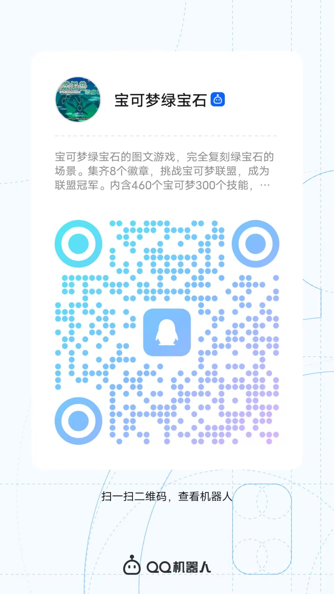

# QQ_Bot_Framework

依据于腾讯QQ官方开发API文档打造的，位于JVM平台的QQ Bot 开发框架。适用于 Kotlin/Java 开发
如果您喜欢本项目请点击一下 star 支持一下！

* **最低JDK版本为 1.8 更低版本请自行编译**
* 项目使用 SL4j 2.0.9 注意版本兼容
# 使用文档

使用前请先去腾讯开发平台申请一个[机器人](https://q.qq.com/#/app/bot)

* 注意：所有的异步API(具有Future返回值的API)，必须使用 `onFailure` 方法来处理异常，否则可能会具有一定概率丢失异常信息。如果不使用系统会进行打印部分日志信息。但是不是全部，如果你选择了自己处理那么系统就不会再打印
* [引入依赖](docs%2Fdependent.md)
* [使用文档](docs%2Flogin.md)
* [事件列表](docs%2Fevents.md)

# 启动转发程序
请从 release 页面下载 Jar 并启动他，之后该程序将会生成配置文件。配置好后再次启动，他将 WebHook 转为 WebSocket。之后就可以通过原本的 WebSocket Client 程序连接到该服务器

# 体验项目
* 成熟项目体验： 宝可梦
宝可梦文字游戏，内含16个城镇，468个宝可梦，mega形态，20多个神兽。获得8大道馆徽章，解决丰缘危机，登上冠军之路，成为联盟冠军吧

